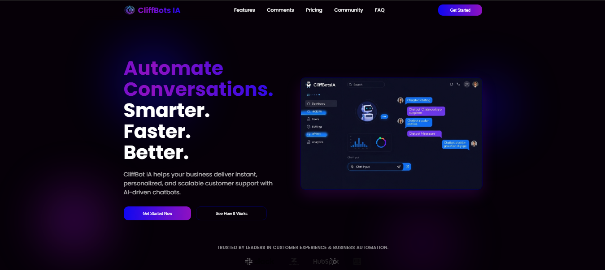

# CliffBots IA - Landing Page de SaaS con React y Framer Motion

 

## 📜 Descripción

Este repositorio contiene el código fuente de una landing page moderna, totalmente responsiva y animada para **CliffBots IA**, una empresa ficticia de SaaS especializada en chatbots de IA. El proyecto está construido desde cero con React y estilizado con CSS puro, haciendo un uso extensivo de la librería **Framer Motion** para crear animaciones fluidas y de alto rendimiento que se activan con el scroll del usuario.

El diseño sigue principios modernos como el **glassmorphism**, fondos con gradientes animados y una estética futurista y limpia, ideal para una marca de tecnología.

---

## ✨ Características Principales

La landing page está dividida en componentes modulares y reutilizables, cubriendo todas las secciones esenciales para un producto SaaS:

-   **🎨 Diseño Moderno:** Estética futurista con efectos de *glassmorphism*, bordes brillantes y una paleta de colores coherente.
-   **🚀 Animaciones Fluidas:** Animaciones de entrada, hover y scroll-triggered impulsadas por **Framer Motion**.
-   **📱 Totalmente Responsiva:** Diseño "mobile-first" que se adapta perfectamente a cualquier dispositivo, desde móviles hasta ordenadores de escritorio.
-   **🧩 Componentes Modulares:** Estructura de proyecto organizada en componentes de React para cada sección.
-   **📜 Scroll Suave:** Navegación interna entre secciones con `react-scroll`.
-   **⚙️ Interactividad:** Componentes interactivos como el carrusel de testimonios (con Swiper.js) y el acordeón de FAQ.

### Secciones Implementadas:
1.  **Header Fijo:** Con menú de navegación y botón de CTA.
2.  **Hero Section:** Título con gradiente animado y imagen flotante.
3.  **Métricas Clave:** Contadores numéricos que se animan al ser visibles.
4.  **Features:** Grid de funcionalidades con íconos.
5.  **Casos de Uso:** Tarjetas con efecto *glow* en hover.
6.  **Testimonios:** Carrusel automático y responsivo.
7.  **Planes de Precios:** Tarjetas de precios con un plan destacado.
8.  **CTA (Call to Action):** Sección de alto impacto con botones animados.
9.  **Comunidad:** Enlaces a redes sociales y formulario de suscripción.
10. **FAQ:** Acordeón animado para preguntas frecuentes.
11. **Footer:** Con enlaces de navegación y redes sociales.

---

## 🛠️ Tech Stack

-   **Frontend:** [React](https://reactjs.org/)
-   **Animaciones:** [Framer Motion](https://www.framer.com/motion/)
-   **Carrusel:** [Swiper.js](https://swiperjs.com/)
-   **Scroll-Triggered Animations:** [React Intersection Observer](https://www.npmjs.com/package/react-intersection-observer)
-   **Navegación Interna:** [React Scroll](https://www.npmjs.com/package/react-scroll)
-   **Iconos:** [React Icons](https://react-icons.github.io/react-icons/) (usando Font Awesome)
-   **Estilos:** CSS puro con variables.

---

## 🚀 Cómo Empezar

Sigue estos pasos para levantar el proyecto en tu entorno local.

### Prerrequisitos

Asegúrate de tener instalado [Node.js](https://nodejs.org/) (versión 16 o superior) y npm.

### Instalación

1.  **Clona el repositorio:**
    ```sh
    git clone https://github.com/YoshuaSoto95/saas_cliffbots_ia_landing_page.git
    ```

2.  **Navega al directorio del proyecto:**
    ```sh
    cd saas_cliffbots_ia_landing_page
    ```

3.  **Instala las dependencias:**
    Este comando leerá el archivo `package.json` e instalará todas las librerías necesarias (React, Framer Motion, etc.).
    ```sh
    npm install
    ```

4.  **Inicia el servidor de desarrollo:**
    ```sh
    npm start
    ```
    La aplicación se abrirá automáticamente en tu navegador en `http://localhost:3000`.

---

## 📂 Estructura del Proyecto

El proyecto está organizado de manera modular para facilitar el mantenimiento y la escalabilidad.

src/

├── assets/ # Imágenes, logos y otros recursos estáticos

├── components/ # Componentes reutilizables de React

│ ├── Community/

│ ├── CTA/

│ ├── FAQ/

│ ├── Features/

│ ├── Footer/

│ ├── Header/

│ ├── Hero/

│ ├── KeyMetrics/

│ ├── Pricing/

│ ├── Testimonials/

│ └── UseCases/

├── App.css # Estilos globales para la aplicación

├── App.js # Componente principal que ensambla la página

└── index.css # Estilos base, fuentes y variables de color CSS

code
Code
---

## 🎨 Personalización

Cambiar la paleta de colores y las fuentes es muy sencillo gracias al uso de variables CSS.

1.  Abre el archivo `src/index.css`.
2.  Modifica las variables dentro del bloque `:root` para ajustar los colores a tu gusto.

```css
:root {
	--light-color-white: #fff;
	--light-blue-hover: #7d79ff;
	--primary-blue: #0f07f1;
	--secondary-blue: #0f09ad;
	--terciary-blue: #03004d;

	--primary-violet: #8f11c1;
	--secondary-violet: #59027c;
	--background-black: #060008;
}